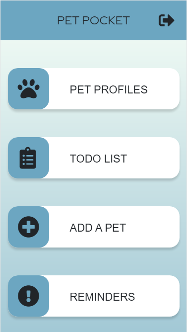

# pet-pocket
A web application for pet owners who want convenient access to their pet's health information
_* Current version of Pet Pocket is for mobile/iPhone 6/7/8_

## Live Link

[Pet Pocket](https://pet-pocket.coronacoding.com/)

## Technologies Used
+ React.js
+ Node.js
+ Express
+ PostreSQL
+ Bootstrap 4
+ HTML 5
+ CSS 3
+ AWS EC2

## Features
+ User can view a list of their pet profiles
+ User can view a single profile with medical history
+ User can view a list of vet visits
+ User can add a vet visit
+ User can edit the profile and medical details of their pet
+ User can add and view a todo list
+ User can view a list of reminders
+ User can view the details of a single reminder

## Preview




## Getting Started
1. Clone the repository
```
git clone https://github.com/Victoria-Corona/pet-pocket

```
2. Navigate to the directory
```
cd pet-pocket
```
3. Install all dependencies with `npm install`
4. Import the existing database with `npm run db:import`
5. Run the project with npm run dev
